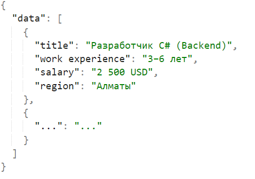
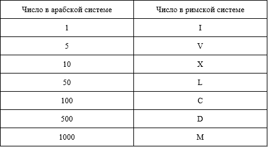

# Практическая работа №2 Основы Python
## 1. Парсинг

Необходимо спарсить данные о вакансиях python разработчиков с сайта hh.ru, введя в поиск “python разработчик” и указав, что мы рассматриваем все регионы. 

Необходимо спарсить:
* Название вакансии
* Требуемый опыт работы
* Заработную плату
* Регион

И сохранить эти данные в формате json в следующем виде:


## 2. Палиндром строки.
Дана строка X, возвращайте True, если X является палиндромом.

*Строка является палиндромом тогда, когда она читается одинаково как в обратном, так и в прямом направлении.*

Например, является “taco cat” является палиндромом, в то время как “black cat” не является.
В данной задаче пробелы не учитываются.

Гарантируется, что исходная строка может содержать символы только нижнего регистра.


Пример 1:
```
Ввод: x = “taco cat”
Вывод: true
```
Пояснение: “taco cat” читается, как “taco cat” слева направо так и справа налево.

Пример 2:
```
Ввод: x = “rotator”
Вывод: true
```
Пояснение: “rotator” читается, как “rotator” слева направо так и справа налево.

Пример 3:
```
Ввод: x = “black cat”
Вывод: false
```
Пояснение: слева направо она читается как “black cat” . Справа налево оно становится “tac kcalb”.
Следовательно, это не палиндром.

Для решения задачи рекомендуем познакомиться с функцией str.replace()

## 3. Перевод арабского числа в римское

Дано целое положительное число X, необходимо вывести вариант этого числа в римской системе счисления в формате строки.



Римские числа записываются от наибольшего числа к наименьшему слева направо.

Однако число 4 не является “IIII”. Вместо этого число 4 записывается, как “IV”. Т.к. 1 стоит перед 5, мы вычитаем 1, делая 4. Тот же принцип применим к числу 9, которое записывается как “IX”.

Случаи, когда используется вычитание:

* I может быть помещен перед V и X, чтобы сделать 4 и 9.
* X может быть помещен перед L и C, чтобы составить 40 и 90.
* C может быть помещен перед D и M, чтобы составить 400 и 900.


Пример 1:
```
Ввод: x = 3
Вывод: “III”
```

Пример 2:
```
Ввод: x = 9
Вывод: “IX”
```

Пример 3:
```
Ввод: x = 1945
Вывод: “MCMXLV”
```

Гарантируется, что введенное число X будет находиться в диапазоне от 1 до 2000

## 4. Валидность скобок

Дана строка X, состоящая только из символов “{“, “}”, “[“, “]”, “(“, “)”. Программа должна вывести True, в том случае если все открытые скобки закрыты. Например: “[()]{}”, все открытые скобки закрыты закрывающимися скобками, потому вывод будет True. В случае же, если строка будет похожа на: “{{{}”, то вывод будет False, т.к. не все открытые скобки закрыты.


Пример 1:
```
Ввод: x = “[{}({})]”
Вывод: True
```

Пример 2:
```
Ввод: x = “{]”
Вывод: False
```

Пример 3:
```
Ввод: x = “{“
Вывод: False
```

Гарантируется, что введенная строка X будет содержать только скобки и не будет пустой.

## 5. Умножить два бинарных числа в формате строк

На вход подаются две строки X1 и X2, содержащие бинарные числа.

Необходимо вывести их бинарное произведение в формате строки.


Пример 1:
```
Ввод: x1 = ‘’111” и x2= “101”
Вывод: “100011”
```
Пояснение: “111” - это 7; “101” - это 5; 7*5 = 35; 35 в двоичной системе 100011

Гарантируется, что введенная строка X будет содержать только числа 1 и 0.