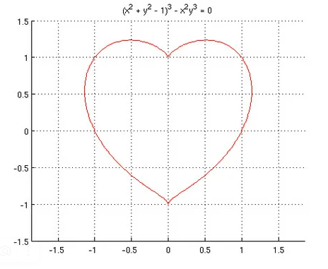
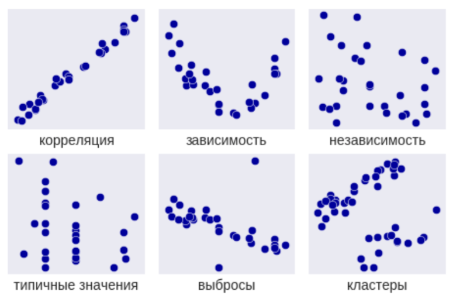

# Использование библиотек NumPy, SciPy

## 1. Построение распределений

Сгенерировать выборку с распределением Рэлэя (https://ru.wikipedia.org/wiki/Распределение_Рэлея) используя numpy и scipy и построить на основе ее кривую плотности распределения на основе гистограммы из Matplotlib.

Более простой вариант, если не справляетесь: Сгенерировать выборку с нормальным распределением (https://ru.wikipedia.org/wiki/Нормальное_распределение) используя numpy и scipy и построить на основе ее кривую плотности распределения на основе гистограммы из Matplotlib.

## 2. Построение графика на по функции

Сгенерировать массивы по функции (x^2 + y^2 - 1)^3 - x^2 y^3 = 0 и построить на основе них график.

Вот примерный график:

## 3. Анализ зависимостей

Найти зависимости представленные в датасете приложенном к заданию.

Виды зависимостей:

Представить в виде графиков в файле формата Notebook.

Для анализа используйте графики scatter, plot, hist, bar из matplotlib и функции numpy и scipy.

Постарайтесь не использовать pandas и др. библиотеки, не указанные ранее.

Из графиков комментариями выписать Ваши выводы по данным 

Например: "Возраст: положительная корреляция с расходами, рост расходов с возрастом".

[dataset_home](https://lhd8ts4trw.a.trbcdn.net/cdn/yusuciqe45/00_data_engineer/dataset_home.txt)
