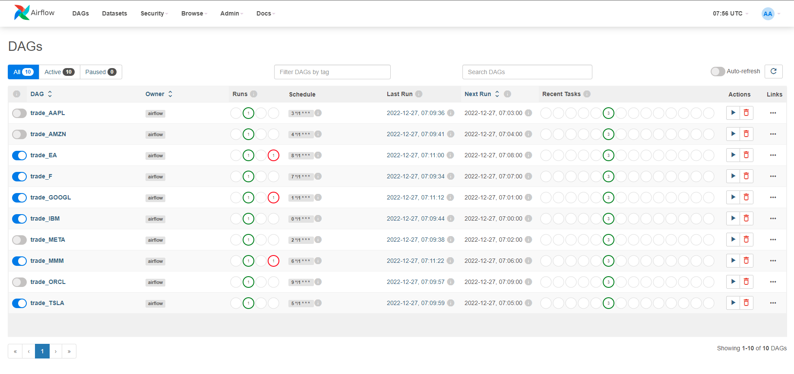
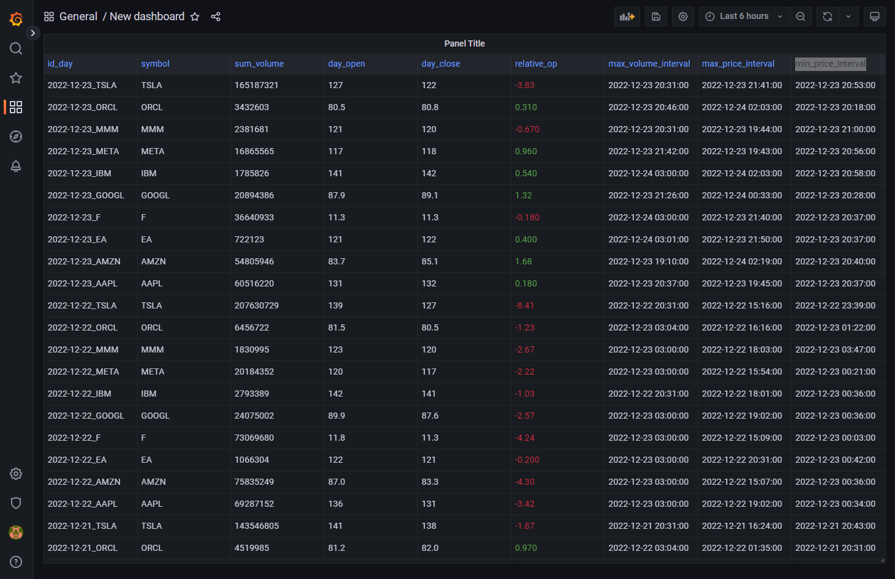
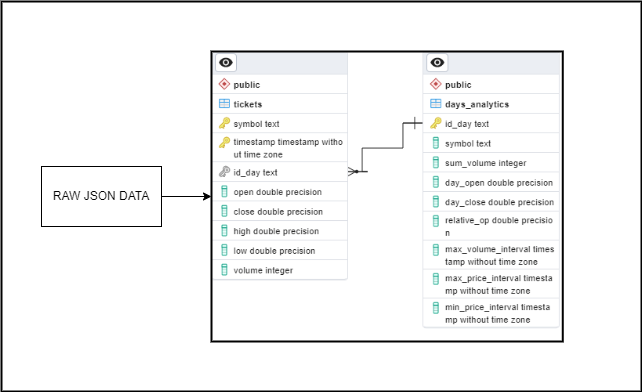

# Итоговая аттестация

## Задание

Для сдачи аттестации выбран Проект №2

<details>
<summary>Описание</summary>

### Анализ рынка валют

**Общая задача:** 
    Создать ETL-процесс формирования витрин данных для анализа изменений курса валют.

**Подробное описание задачи:**
1.  Разработать скрипты загрузки данных в 2-х режимах:
    *   Инициализирующий – загрузка полного слепка данных источника
    *   Инкрементальный – загрузка дельты данных за прошедшие сутки

2.  Организовать правильную структуру хранения данных
    *   Сырой слой данных
    *   Промежуточный слой
    *   Слой витрин

3.  В качестве результата работы программного продукта необходимо написать скрипт, который формирует витрину данных следующего содержания
    *   Суррогатный ключ категории
    *   Название валюты
    *   Суммарный объем торгов за последние сутки
    *   Курс валюты на момент открытия торгов для данных суток
    *   Курс валюты на момент закрытия торгов для данных суток
    *   Разница(в %) курса с момента открытия до момента закрытия торгов для данных суток
    *   Минимальный временной интервал, на котором был зафиксирован самый крупный объем торгов для данных суток
    *   Минимальный временной интервал, на котором был зафиксирован максимальный курс для данных суток
    *   Минимальный временной интервал, на котором был зафиксирован минимальный курс торгов для данных суток

**Дополнение:**
    В качестве основы витрины необходимо выбрать 5-10 различных валют или акций компаний.

**Источники:**
    https://www.alphavantage.co/

</details>

<details>
<summary>Общие требования и рекомендации</summary>

В качестве результата вашей работы по проекту, вам необходимо предоставить репозиторий с **`целым(!)`** проектом.

У проекта должна быть `понятная структура`, код и данные не должны лежать в одном месте. Почитать про то, как организовать структуру проекта на примере Python можно тут: https://habr.com/ru/company/wunderfund/blog/678634/

К проекту обязательно должен быть приложен `README-файл` с подробным описанием проекта, его содержанием, использованным стеком, последовательностью шагов реализации проекта и блок-схемой проекта (опционально, но для наглядности лучше сделать).

В коде должны быть использованы правильные имена переменных, таблиц, функций. Имена переменных формата x1, a, AAA будут считаться ошибкой.

Желательно использовать комментарии в коде.

Выбор стека технологий является для вас ключевой задачей. Тут вы свободны выбирать, но в итоговой презентации (об этом ниже) вам необходимо будет обосновать выбор того или иного инструмента для решения конкретной задачи.

В проектах с двумя режимами загрузки должна присутствовать `оркестрация`. Выбор инструмента оркестарции также остается за вами. Crontab тоже засчитывается.

В каждом из проектов, особенно в анализе логов, должен быть процесс `data quality`, по итогам которого данные будут проанализированы на корректность, исправлены все ошибки/опечатки, структура и типы данных приведены в необходимый формат. Также, необходимо подготовить мини-отчет по качеству входных данных, если источников несколько, то для каждого из источников свой отчет.

В каждом проекте должна присутствовать `ER-диаграмма` вашей модели данных. Или, если вы решите все данные держать в одной плоской табличке(это не значит, что так делать правильно), то необходимо описание полей таблицы и их типов. Инструменты для отрисовки ER-диаграмм:
* Gliffy - https://www.gliffy.com/
* Draw.io - https://app.diagrams.net/
* Miro - https://miro.com/ru/
* PlantUML - https://plantuml.com/ru/ie-diagram
* Или любой другой на ваш выбор

Вам необходимо подготовить `итоговую презентацию`, в которой необходимо отразить.
* Название и общее описание проекта.
* Цели проекта с описание бизнес-задачи и требованиями
* План реализации
* Используемые технологии с обоснованием
* Схемы/архитектуры с обоснованием
* Результаты разработки
* Выводы

Презентацию лучше сделать короткой, чем длинной.

Расширение функционала поверх требуемого крайне приветствуется.

Если Вы хотите выполнить итоговую аттестацию на базе собственного проекта (ссылку на репозиторий отправляйте в проект №6), который выражается в проведении каких-то собственных исследований на открытых данных или в рамках своих рабочих данных, не представляющих какую-либо тайну, то зачтем аттестацию и в таком виде. Также аттестационная работа может быть зачтена в виде научной статьи — опубликованной или готовящейся к публикации.

</details>

<br>

--------------------------------------------------------

## Стек программы и dev-ops разработка

Поставленная задача будет разбита на 3 процесса:
* Скачивание и сохранение данных
* Обработка данных
* Демонстрация

Из этого у меня выстраивается следующий стек программ:
* `Airflow` - для оркестрирования скриптов скачивания и обработки
* `PostgreSQL` - для хранения как сырых так и обработанных данных
* `Grafana` - для демонстрации готовых обработанных данных

Весь этот стек будет развёрнут через `Docker` для удобства повторения на других компьютерах.

В качестве основы был использован официальный **docker-compose** файл: https://airflow.apache.org/docs/apache-airflow/2.5.0/docker-compose.yaml.

Его изменения:
* удалён `flower` за ненадобностью
* все директории относящиеся к контейнерам перенесены в папку `./dockermount`
* БД была перенесена в локальную папку `./dockermount/postgres-db`
* данные redis перенесены в папку `./dockermount/redis`
* убраны примеры DAGs из Airflow
* добавлен `PgAdmin`
* добавлен `Grafana`

<br>

--------------------------------------------------------

## Установка

Перед запуском вам требуется установить:
* **Docker**  https://www.docker.com/
* **Docker-compose** https://docs.docker.com/compose/install/

После необходимых установок войдите в командную строку и перейдите в корневую папку проекта. Запустите docker-compose.
```
cd /path/to/project
docker-compose up -d
```

### Точки входа
* **Grafana**
    * *URL*: http://localhost:8080/
    * *Логин*: admin
    * *Пароль*: admin
* **Airflow**
    * *URL*: http://localhost:8090/
    * *Логин*: airflow
    * *Пароль*: airflow
* **PgAdmin**
    * *URL*: http://localhost:8100/
    * *Логин*: airflow@mail.ru
    * *Пароль*: airflow
* **PostgresSQL**
    * *URL*: postgres
    * *Логин*: airflow
    * *Пароль*: airflow

<br>

----------------------------------------------------------

## Запуск и настройка

Для запуска перейдите на главную страницу `Airflow` http://localhost:8090/

Вы увидите задачи по каждому отдельной валюте. Это связано с тем что API через который берутся данные по валютам имеет ограничение в 5 запросов в минуту. Задачи создаются автоматически исходя из настроек. Все настройки можно сделать добавив параметры в разделе **Admin > Variables** http://localhost:8090/variable/list/

Настройки:
*   `apikey` - API ключ из портала **alphavantage** https://www.alphavantage.co/support/#api-key 
    *   *По умолчанию: BV2KKAXL81BMBVWB*
*   `path_raw_data_file` - место сохранения необработанных(сырых) данных
    *   *По умолчанию: /opt/airflow/dags/*
*   `symbols` - список символов валют
    *   *По умолчанию: IBM, GOOGL, META, AAPL, AMZN, TSLA, MMM, F, EA, ORCL*



Для просмотра окончательного результата зайдите в `Grafana` http://localhost:8080/

В разделе **Dashbords** Будет единственная табличная панель показывающая итоговую дневную аналитику:
* **id_days** - Суррогатный ключ категории
* **symbol** - Название валюты
* **sum_volume** - Суммарный объем торгов за последние сутки
* **day_open** - Курс валюты на момент открытия торгов для данных суток
* **day_close** - Курс валюты на момент закрытия торгов для данных суток
* **relative_op** - Разница(в %) курса с момента открытия до момента закрытия торгов для данных суток
* **max_volume_interval** - Минимальный временной интервал, на котором был зафиксирован самый крупный объем торгов для данных суток
* **max_price_interval** - Минимальный временной интервал, на котором был зафиксирован максимальный курс для данных суток
* **min_price_interval** - Минимальный временной интервал, на котором был зафиксирован минимальный курс торгов для данных суток



<br>

----------------------------------------------------------

## Логика работы

Airflow создаёт задачи в зависимости от списка символов валют. Все задачи запускаются с периодичностью в час, но время старта различны на одну минуту от предыдущей. Тем самым обходится ограничения API. 

В каждой задаче созданы 3 оператора выполняющиеся последовательно друг за другом:
* **download_tickers** - скачивание JSON данных о торговле валюты и записи в файл
* **write_ticker_to_db** - перенос данных в таблицу БД исключая повторения и двойников
* **create_days_analytics** - создание дневной аналитики исходя из предыдущей таблицы

### **download_tickers**

Реализовано два типа скачивания:
* **compact** - возвращает последние 100 записей
* **full** - возвращает полный внутридневной временной ряд на несколько дней

Выбор типа скачивания осуществляется автоматически в зависимости от наличия уже скаченных данных; Если файла нет то full, если есть то compact. Каждая последующая скачка перезаписывает предыдущий файл введу отсутствия необходимости хранения сырых данных после их сохранения в БД.

### **write_ticker_to_db**

Простая функция перебирающая json файл с данными и переносящая в таблицу **tickets**. 

В таблице поля symbol, отвечающая за символ валюты, и timestamp, отвечающая за временную метку, являются первичными ключами, поэтому дублирований быть не может. Также таблица имеет триггерную процедуру которая автоматически добавляет суррогатный ключ **id_day** в формате YYYY-MM-DD_SYMBOL 

Например: 2022-12-23_IBM

### **create_days_analytics**

функция для создания анализа дня и записи в таблицу БД **days_analytics**. Самый последний день в имеющихся данных таблицы tickets обновляется всегда. Это сделано дабы актуализировать аналитику за сегодняшний неоконченный день по мере добавления данных. Предыдущие дни анализируются только в том случае если аналитики на этот день нет. Если 5 дней подряд не было ни аналитики ни данных для их создания то процесс создания аналитики заканчивается. Промежуток в 5 дней обусловлен возможными выходными, когда торговая площадка не работает и не производит данных.

<br>

----------------------------------------------------------

## ER-диаграмма

